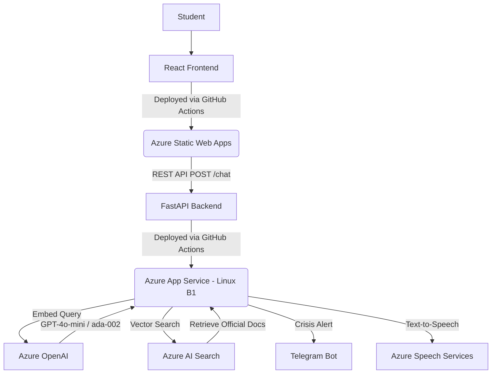
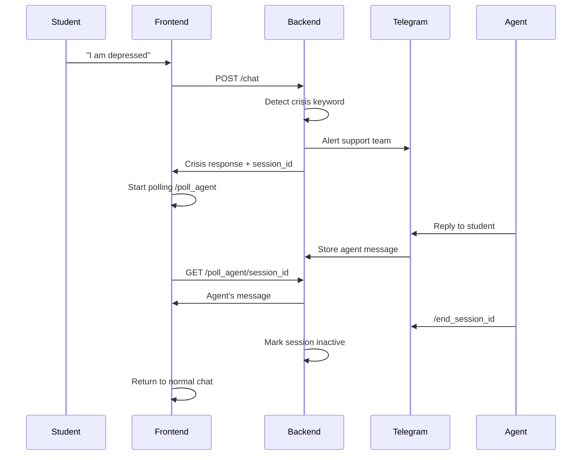

# ChariotAI - Complete Migration & Deployment Guide

**Version:** 1.0  
**Last Updated:** April 2026  
**Target Audience:** Universities, IT Departments, DevOps Teams

---

## Table of Contents

1. [Overview](#overview)
2. [Prerequisites](#prerequisites)
3. [Quick Start (10 Minutes)](#quick-start-10-minutes)
4. [Architecture Deep Dive](#architecture-deep-dive)
5. [Backend API Documentation](#backend-api-documentation)
6. [Data Ingestion Guide](#data-ingestion-guide)
7. [Telegram Crisis Support Setup](#telegram-crisis-support-setup)
8. [Azure Speech Services Setup](#azure-speech-services-setup)
9. [Local Development Setup](#local-development-setup)
10. [Production Deployment](#production-deployment)
11. [Customization Guide](#customization-guide)
12. [Troubleshooting](#troubleshooting)
13. [Cost Estimation](#cost-estimation)

---

## Overview

ChariotAI is an enterprise-grade, RAG-powered (Retrieval-Augmented Generation) student support chatbot that provides 24/7 accurate answers to student queries. It features:

✅ AI chatbot answering student questions 24/7  
✅ Crisis detection with live Telegram support  
✅ Text-to-Speech and Speech-to-Text capabilities  
✅ Fully hosted on Azure (GDPR compliant)  
✅ Auto-scaling infrastructure  
✅ Costs £60-210/month for 10,000 students  

### Tech Stack

- **Frontend**: React 19 + Vite (Tailwind/CSS glassmorphism UI)
- **Backend**: Python FastAPI (High-performance async REST framework)
- **AI Orchestrator**: LangChain (Conversation memory and RAG execution)
- **Vector Database**: Azure AI Search (HNSW algorithm for semantic search)
- **LLM**: Azure OpenAI (`gpt-4o-mini` and `text-embedding-ada-002`)
- **CI/CD**: GitHub Actions (Independent pipelines for frontend and backend)
- **Infrastructure**: HashiCorp Terraform (Provisions entire Azure ecosystem)

---

## Prerequisites

### Required Tools (5 minutes to install)

1. **Azure Subscription** - [Get free trial](https://azure.microsoft.com/free/)
2. **Azure CLI** - [Install here](https://docs.microsoft.com/cli/azure/install-azure-cli)
3. **Terraform** (v1.5+) - [Install here](https://www.terraform.io/downloads)
4. **Node.js** (v18+) - [Install here](https://nodejs.org/)
5. **Python** (v3.12+) - [Install here](https://www.python.org/)
6. **Git** - [Install here](https://git-scm.com/)

### Required Azure Resources

- Azure OpenAI Service (GPT-4o-mini + text-embedding-ada-002)
- Azure AI Search (Free or Basic tier)
- Azure App Service (B1 or higher)
- Azure Static Web Apps (Free tier)

### Optional Services

- **Telegram Bot** (for crisis support) - Message `@BotFather` on Telegram
- **Azure Speech Services** (for TTS/STT) - Free tier available

---

## Quick Start (10 Minutes)

### Step 1: Clone Repository

```bash
git clone https://github.com/YOUR_USERNAME/AIChatbotUniKent.git
cd AIChatbotUniKent
```

### Step 2: Login to Azure

```bash
az login
az account set --subscription "YOUR_SUBSCRIPTION_NAME"
```

### Step 3: Configure Terraform

```bash
cd terraform
cp terraform.tfvars.example terraform.tfvars
```

Edit `terraform.tfvars` with your details:

```hcl
# Azure credentials
subscription_id = "your-azure-subscription-id"
tenant_id       = "your-azure-tenant-id"

# University branding
app_name            = "oxford-chatbot"
resource_group_name = "rg-oxford-chatbot"

# Telegram (optional - for crisis support)
telegram_bot_token = "123456789:ABCdef..."
telegram_chat_id   = "123456789"

# GitHub repo (for CI/CD)
github_repo = "oxford-university/chatbot"
```

### Step 4: Deploy Infrastructure

```bash
terraform init
terraform plan
terraform apply
```

Type `yes` when prompted. Deployment takes ~5-10 minutes.

### Step 5: Get Your URLs

```bash
terraform output
```

You'll see:
- `frontend_url` - Your chatbot website
- `backend_url` - Your API endpoint
- `openai_endpoint` - Your Azure OpenAI endpoint

### Step 6: Ingest Your University Data

```bash
cd ../backend
pip install -r requirements.txt
python ingest.py
```

**Done!** Your chatbot is live at the `frontend_url`.

---

## Architecture Deep Dive

### System Architecture



### Multi-Region Strategy

To bypass regional capacity quotas, ChariotAI uses a distributed cloud model:

1. **Compute (Static Web App & App Service)**: West Europe (Amsterdam)
2. **AI Data (OpenAI & Search)**: UK South (London)

This ensures data residency for AI models (UK-based) while maintaining high compute availability. Latency penalty is <15ms.

### Security & Safety

- **GDPR Compliance**: Managed identities and Azure OpenAI's non-retention policies
- **Crisis Handoff**: Hard-coded safety net for life-threatening queries
- **Zero Hallucination Policy**: LLM restricted to `temperature=0.0`
- **Verified Attribution**: All answers grounded in retrieved documents

---

## Backend API Documentation

### Base URL

- **Local Development**: `http://127.0.0.1:8000`
- **Production**: `https://your-app-name-api-prod.azurewebsites.net`

### Endpoints

#### 1. Health Check

```http
GET /health
```

**Response:**
```json
{
  "status": "healthy",
  "service": "ChariotAI",
  "config": "OK"
}
```

#### 2. Chat Endpoint

```http
POST /chat
Content-Type: application/json
```

**Request Body:**
```json
{
  "message": "Tell me about accommodation",
  "history": [
    {
      "role": "human",
      "text": "Hello"
    },
    {
      "role": "ai",
      "text": "Hi! How can I help you?"
    }
  ],
  "session_id": null
}
```

**Response:**
```json
{
  "answer": "The University offers various accommodation options...",
  "sources": [
    "https://www.kent.ac.uk/accommodation/canterbury/prices"
  ],
  "handoff_required": false,
  "session_id": null
}
```

**Crisis Response:**
```json
{
  "answer": "I can hear that you're going through a difficult time...",
  "sources": ["https://www.kent.ac.uk/student-support"],
  "handoff_required": true,
  "session_id": "abc123de"
}
```

#### 3. Poll Agent Messages (Crisis Sessions)

```http
GET /poll_agent/{session_id}
```

**Response:**
```json
{
  "messages": [
    {
      "text": "Hi, I'm here to help. How are you feeling?",
      "timestamp": "2026-04-07T14:30:00"
    }
  ],
  "active": true
}
```

#### 4. Text-to-Speech

```http
POST /tts?text=Hello%20student
```

**Response:** Audio WAV file (binary)

### Request/Response Models

**ChatRequest:**
- `message` (string, max 2000 chars): User's question
- `history` (array): Last 6 messages for context
- `session_id` (string, optional): For ongoing crisis sessions

**ChatResponse:**
- `answer` (string): AI-generated response
- `sources` (array): URLs of source documents
- `handoff_required` (boolean): True if crisis detected
- `session_id` (string, optional): Crisis session identifier

### Crisis Keywords

The backend monitors for these keywords to trigger crisis handoff:

```python
CRISIS_KEYWORDS = [
    "suicide", "suicidal", "kill myself", "end my life",
    "self-harm", "cut myself", "hurt myself",
    "depressed", "depression", "hopeless",
    "crisis", "emergency", "overwhelmed"
]
```

---

## Data Ingestion Guide

### Overview

The `ingest.py` script scrapes university web pages, chunks the content, generates embeddings, and uploads to Azure AI Search.

### Default URLs (University of Kent)

```python
KENT_URLS = [
    "https://www.kent.ac.uk/courses/undergraduate",
    "https://www.kent.ac.uk/whats-on#events",
    "https://www.kent.ac.uk/student-life",
    "https://www.kent.ac.uk/courses/visit/open-days",
    "https://www.kent.ac.uk/accommodation/canterbury/prices",
    "https://www.kent.ac.uk/courses/postgraduate",
    "https://www.kent.ac.uk/international/international-applicant-faqs"
]
```

### Customizing for Your University

#### Option 1: Modify URLs in Code

Edit `backend/ingest.py`:

```python
KENT_URLS = [
    "https://www.your-university.edu/admissions",
    "https://www.your-university.edu/student-life",
    "https://www.your-university.edu/accommodation",
    # Add more URLs
]
```

#### Option 2: Ingest from Local Files

Create a folder with `.txt` files:

```bash
mkdir university-data
cd university-data
```

Add files like:
- `admissions.txt`
- `accommodation.txt`
- `student-support.txt`

Modify `ingest.py` to read from files:

```python
import glob

def load_local_files(folder_path: str):
    documents = []
    for filepath in glob.glob(f"{folder_path}/*.txt"):
        with open(filepath, 'r', encoding='utf-8') as f:
            content = f.read()
            documents.append({
                'content': content,
                'source': filepath
            })
    return documents
```

### Running Ingestion

```bash
cd backend
python ingest.py
```

**Output:**
```
--- Starting ChariotAI Knowledge Ingestion ---
Scraping: https://www.kent.ac.uk/courses/undergraduate
  -> Split into 12 chunks.
Scraping: https://www.kent.ac.uk/whats-on#events
  -> Split into 8 chunks.
...
Uploading 67 vectorized chunks to Azure AI Search...
Upload complete! Knowledge Base is ready.
```

### How It Works

1. **Scraping**: BeautifulSoup extracts text from `<p>` tags
2. **Chunking**: RecursiveCharacterTextSplitter creates 1000-char chunks with 100-char overlap
3. **Embedding**: Azure OpenAI `text-embedding-ada-002` converts text to 1536-dimensional vectors
4. **Upload**: Chunks uploaded to Azure AI Search with HNSW indexing

### Re-ingesting Data

To update the knowledge base:

```bash
python ingest.py
```

The script is idempotent - it will update existing documents or add new ones.

---

## Telegram Crisis Support Setup

### Step 1: Create Telegram Bot

1. Open Telegram and search for `@BotFather`
2. Send `/newbot`
3. Choose a name: "YourUniversity Support"
4. Choose a username: "youruniversity_support_bot"
5. Copy the **bot token** (looks like: `123456789:ABCdefGHIjklMNOpqrsTUVwxyz`)

### Step 2: Get Your Chat ID

**Option A: Personal Chat**
1. Search for `@userinfobot` on Telegram
2. Start a chat with it
3. It will send you your **Chat ID** (a number like: `123456789`)

**Option B: Group Chat**
1. Create a Telegram group
2. Add your bot to the group
3. Add `@RawDataBot` to the group
4. It will show the group's chat ID

### Step 3: Configure Environment Variables

Add to `.env` file:

```env
TELEGRAM_BOT_TOKEN="123456789:ABCdefGHIjklMNOpqrsTUVwxyz"
TELEGRAM_CHAT_ID="123456789"
```

Add to Azure App Service (Portal → Environment Variables):
- `TELEGRAM_BOT_TOKEN`
- `TELEGRAM_CHAT_ID`

### Step 4: Test Crisis Detection

1. Visit your chatbot
2. Type: "I am feeling depressed"
3. You should receive a Telegram alert with the student's message
4. Reply on Telegram - your message appears on the website
5. Type `/end_abc123de` (replace with session ID) to close the session

### How It Works

1. **Crisis Detection**: Backend scans for crisis keywords
2. **Session Creation**: Generates unique session ID (e.g., `abc123de`)
3. **Telegram Alert**: Sends alert to support team with session ID
4. **Bidirectional Chat**: 
   - Student messages forwarded to Telegram
   - Agent replies sent back to website
5. **Session End**: Agent types `/end_sessionid` to return student to normal chatbot

### Crisis Response Flow



---

## Azure Speech Services Setup

### Step 1: Create Speech Resource

1. Go to [Azure Portal](https://portal.azure.com)
2. Create new resource → Search "Speech"
3. Click "Speech Services"
4. Fill in:
   - **Resource group**: Use existing or create new
   - **Region**: UK South (closest to Kent)
   - **Name**: `kent-speech-service`
   - **Pricing tier**: Free F0 (5 hours audio/month free)
5. Click "Review + Create"

### Step 2: Get Keys

1. Go to your Speech resource
2. Click "Keys and Endpoint"
3. Copy **KEY 1**
4. Note the **Location/Region** (should be `uksouth`)

### Step 3: Configure Environment Variables

Add to `.env` file:

```env
AZURE_SPEECH_KEY="your-speech-key-here"
AZURE_SPEECH_REGION="uksouth"
```

Add to Azure App Service:
- `AZURE_SPEECH_KEY`
- `AZURE_SPEECH_REGION`

### Step 4: Test Text-to-Speech

1. Visit your chatbot
2. Ask a question
3. Click the speaker icon 🔊 on the AI response
4. You should hear a natural British English voice

### Features

**Text-to-Speech (TTS):**
- Voice: `en-GB-SoniaNeural` (British English female)
- Format: WAV audio
- Fallback: Browser's built-in TTS if Azure fails

**Speech-to-Text (STT):**
- Uses browser's Web Speech API (free)
- Language: `en-GB`
- Click microphone icon to record

### Pricing

- **Free Tier**: 5 hours audio/month
- **Paid**: $1/hour after free tier
- **Estimated usage**: ~10 minutes for 5 students = FREE

---

## Local Development Setup

### Backend Setup

1. **Create virtual environment:**

```bash
cd backend
python -m venv venv

# Windows
venv\Scripts\activate

# Mac/Linux
source venv/bin/activate
```

2. **Install dependencies:**

```bash
pip install -r requirements.txt
```

3. **Create `.env` file:**

```env
# Azure OpenAI
AZURE_OPENAI_ENDPOINT="https://your-openai.openai.azure.com/"
AZURE_OPENAI_KEY="your-openai-key"
AZURE_OPENAI_API_VERSION="2024-02-15-preview"
AZURE_GPT_DEPLOYMENT="gpt-4o-mini"
AZURE_EMBEDDING_DEPLOYMENT="text-embedding-ada-002"

# Azure AI Search
AZURE_SEARCH_ENDPOINT="https://your-search.search.windows.net"
AZURE_SEARCH_KEY="your-search-key"
AZURE_SEARCH_INDEX="chariotai-index"

# CORS (for local frontend)
CORS_ALLOWED_ORIGINS="http://localhost:5173"

# Optional: Telegram
TELEGRAM_BOT_TOKEN="your-bot-token"
TELEGRAM_CHAT_ID="your-chat-id"

# Optional: Speech
AZURE_SPEECH_KEY="your-speech-key"
AZURE_SPEECH_REGION="uksouth"
```

4. **Run backend:**

```bash
uvicorn main:app --reload
```

Backend runs at: `http://127.0.0.1:8000`

### Frontend Setup

1. **Install dependencies:**

```bash
cd frontend
npm install
```

2. **Create `.env.local` file:**

```env
VITE_BACKEND_URL=http://127.0.0.1:8000
```

3. **Run frontend:**

```bash
npm run dev
```

Frontend runs at: `http://localhost:5173`

### Testing the Full Stack

1. Open browser to `http://localhost:5173`
2. Ask: "Tell me about accommodation"
3. Check backend logs for:
   - Embedding time
   - Search time
   - LLM time
4. Verify response includes sources

### Common Development Issues

**Issue: CORS errors**
- Solution: Add `http://localhost:5173` to `CORS_ALLOWED_ORIGINS` in `.env`

**Issue: "Module not found" errors**
- Solution: Ensure virtual environment is activated and dependencies installed

**Issue: Azure OpenAI quota exceeded**
- Solution: Check Azure Portal → OpenAI → Quotas & Usage

**Issue: Slow responses (>10 seconds)**
- Solution: Check Azure region latency, consider moving resources closer

---

## Production Deployment

### GitHub Actions CI/CD

The monorepo uses two independent pipelines:

#### Frontend Pipeline (`.github/workflows/frontend-deploy.yml`)

Triggers on changes to `frontend/**`

```yaml
name: Deploy Frontend
on:
  push:
    paths: ['frontend/**']
    branches: [main]

jobs:
  build-and-deploy:
    runs-on: ubuntu-latest
    steps:
      - uses: actions/checkout@v3
      - name: Build
        run: |
          cd frontend
          npm install
          npm run build
      - name: Deploy to Azure Static Web Apps
        uses: Azure/static-web-apps-deploy@v1
        with:
          azure_static_web_apps_api_token: ${{ secrets.AZURE_STATIC_WEB_APPS_API_TOKEN }}
          repo_token: ${{ secrets.GITHUB_TOKEN }}
          action: "upload"
          app_location: "/frontend"
          output_location: "dist"
```

#### Backend Pipeline (`.github/workflows/backend-deploy.yml`)

Triggers on changes to `backend/**`

```yaml
name: Deploy Backend
on:
  push:
    paths: ['backend/**']
    branches: [main]

jobs:
  build-and-deploy:
    runs-on: ubuntu-latest
    steps:
      - uses: actions/checkout@v3
      - name: Set up Python
        uses: actions/setup-python@v4
        with:
          python-version: '3.12'
      - name: Install dependencies
        run: |
          cd backend
          pip install -r requirements.txt
      - name: Deploy to Azure App Service
        uses: azure/webapps-deploy@v2
        with:
          app-name: ${{ secrets.AZURE_APP_SERVICE_NAME }}
          publish-profile: ${{ secrets.AZURE_APP_SERVICE_PUBLISH_PROFILE }}
          package: ./backend
```

### Required GitHub Secrets

Add these in GitHub → Settings → Secrets:

- `AZURE_STATIC_WEB_APPS_API_TOKEN`
- `AZURE_APP_SERVICE_NAME`
- `AZURE_APP_SERVICE_PUBLISH_PROFILE`

### Deployment Process

1. Make changes to code
2. Commit and push to `main` branch
3. GitHub Actions automatically detects changed files
4. Only affected service (frontend or backend) is deployed
5. Check Actions tab for deployment status

### Manual Deployment

**Frontend:**
```bash
cd frontend
npm run build
# Upload dist/ folder to Azure Static Web Apps
```

**Backend:**
```bash
cd backend
zip -r backend.zip .
az webapp deployment source config-zip \
  --resource-group rg-chariotai \
  --name chariotai-api-prod \
  --src backend.zip
```

---

## Customization Guide

### Change University Name

**Frontend (`frontend/src/App.jsx`):**
```javascript
<h1>🤖 YourUniversity AI Assistant</h1>
<p>Your inclusive AI assistant for campus life</p>
```

### Update Crisis Keywords

**Backend (`backend/main.py`):**
```python
CRISIS_KEYWORDS = [
    "suicide", "depressed", "crisis",
    # Add your university-specific terms
    "counseling", "mental health"
]
```

### Change Colors & Branding

**Frontend (`frontend/src/index.css`):**
```css
:root {
  --primary-color: #003B5C;  /* Your university color */
  --accent-teal: #00A3A3;
  --accent-orange: #FF6B35;
}
```

### Modify Crisis Response

**Backend (`backend/main.py`):**
```python
return ChatResponse(
    answer="""Your custom crisis response here.

**Immediate support:**
• Your University Counseling: **XXX-XXX-XXXX**
• National Hotline: **XXX-XXX-XXXX**
""",
    sources=["https://your-university.edu/support"],
    handoff_required=True
)
```

### Add New Data Sources

**Backend (`backend/ingest.py`):**
```python
KENT_URLS = [
    "https://your-university.edu/admissions",
    "https://your-university.edu/financial-aid",
    # Add more URLs
]
```

### Change LLM Temperature

**Backend (`backend/main.py`):**
```python
llm = AzureChatOpenAI(
    azure_deployment=os.getenv("AZURE_GPT_DEPLOYMENT"),
    temperature=0.2  # 0.0 = strict, 1.0 = creative
)
```

---

## Troubleshooting

### Backend Issues

**Error: "Insufficient quota"**
- **Cause**: Azure OpenAI quota exceeded
- **Solution**: Check Azure Portal → OpenAI → Quotas, request increase

**Error: "CORS policy blocked"**
- **Cause**: Frontend URL not in allowed origins
- **Solution**: Add URL to `CORS_ALLOWED_ORIGINS` in App Service environment variables

**Error: "Module 'telegram' not found"**
- **Cause**: Telegram dependencies not installed
- **Solution**: `pip install python-telegram-bot`

**Error: "Search index not found"**
- **Cause**: Data not ingested
- **Solution**: Run `python ingest.py`

### Frontend Issues

**Error: "Failed to fetch"**
- **Cause**: Backend not running or wrong URL
- **Solution**: Check `VITE_BACKEND_URL` in `.env.local`

**Error: "Network request failed"**
- **Cause**: CORS or backend timeout
- **Solution**: Check backend logs, verify CORS settings

### Terraform Issues

**Error: "Resource already exists"**
- **Cause**: Resources from previous deployment
- **Solution**: `terraform import` existing resources or `terraform destroy` first

**Error: "Quota exceeded for resource"**
- **Cause**: Azure subscription limits
- **Solution**: Change region in `terraform.tfvars` or request quota increase

### Performance Issues

**Slow responses (>10 seconds)**
- Check Azure region latency
- Verify App Service is not in "cold start" (enable `always_on = true`)
- Consider upgrading App Service SKU

**High costs**
- Review Azure Cost Management
- Consider using Free tier for AI Search
- Optimize LLM token usage

---

## Cost Estimation

### Small University (<5,000 students)

| Resource | SKU | Monthly Cost |
|----------|-----|--------------|
| Static Web App | Free | £0 |
| App Service | B1 | £10 |
| Azure OpenAI | Pay-per-use | £30-50 |
| AI Search | Free | £0 |
| Speech Services | Free (5hrs) | £0 |
| Telegram Bot | N/A | £0 |
| **Total** | | **£40-60/month** |

### Medium University (5,000-10,000 students)

| Resource | SKU | Monthly Cost |
|----------|-----|--------------|
| Static Web App | Free | £0 |
| App Service | B2 | £30 |
| Azure OpenAI | Pay-per-use | £50-100 |
| AI Search | Basic | £60 |
| Speech Services | Paid | £10 |
| Telegram Bot | N/A | £0 |
| **Total** | | **£150-200/month** |

### Large University (>10,000 students)

| Resource | SKU | Monthly Cost |
|----------|-----|--------------|
| Static Web App | Standard | £7 |
| App Service | S1 | £50 |
| Azure OpenAI | Pay-per-use | £100-200 |
| AI Search | Standard | £200 |
| Speech Services | Paid | £20 |
| Telegram Bot | N/A | £0 |
| **Total** | | **£377-477/month** |

### Cost Optimization Tips

1. **Use Free tiers**: AI Search Free tier supports up to 50MB
2. **Enable caching**: Reduce duplicate OpenAI calls
3. **Optimize prompts**: Shorter prompts = lower token costs
4. **Use B1 App Service**: Sufficient for most universities
5. **Monitor usage**: Set up Azure Cost Alerts

---

## Support & Resources

### Documentation

- **Main README**: [Readme.md](./Readme.md)
- **Terraform Guide**: [terraform/README.md](./terraform/README.md)
- **Architecture Spec**: [arc.md](./arc.md)

### External Resources

- [Azure OpenAI Documentation](https://learn.microsoft.com/en-us/azure/ai-services/openai/)
- [LangChain Documentation](https://python.langchain.com/)
- [FastAPI Documentation](https://fastapi.tiangolo.com/)
- [Terraform Azure Provider](https://registry.terraform.io/providers/hashicorp/azurerm/latest/docs)

### Getting Help

- **GitHub Issues**: [Report bugs or request features](https://github.com/YOUR_USERNAME/AIChatbotUniKent/issues)
- **Azure Support**: [Azure Portal Support](https://portal.azure.com/#blade/Microsoft_Azure_Support/HelpAndSupportBlade)

---

## License

MIT License - Free for universities to use and modify.

---

**Built with ❤️ for higher education institutions worldwide.**
