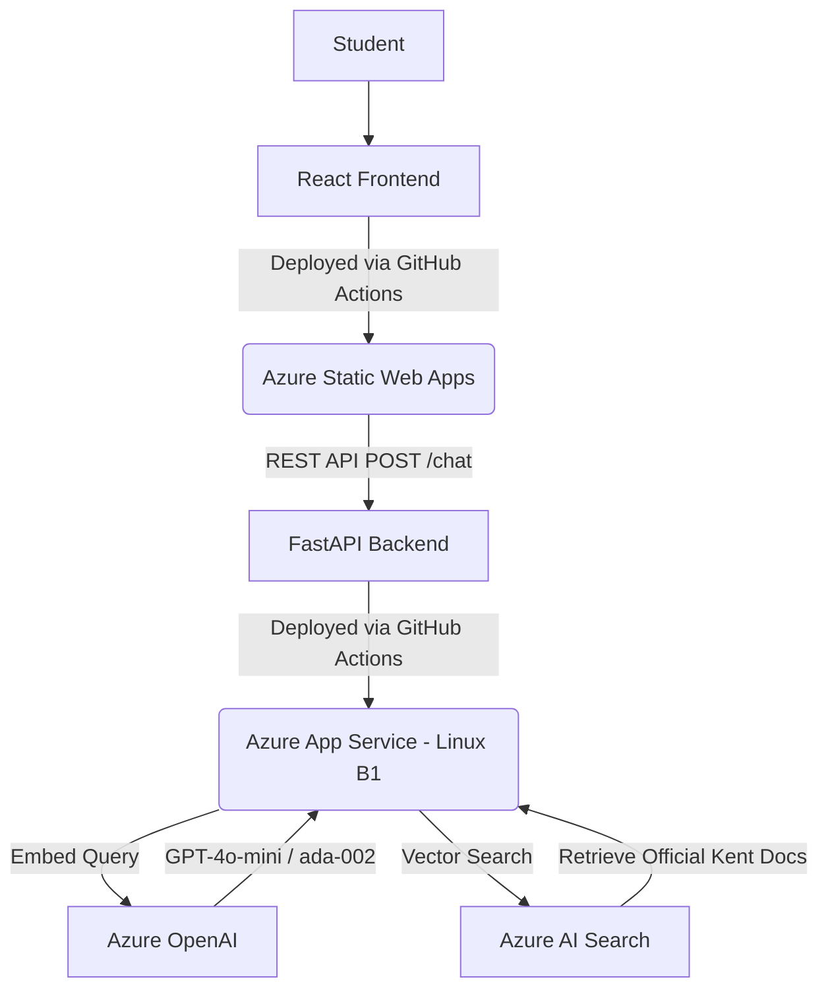

# ChariotAI — AI Powered Student Support Chatbot

**ChariotAI** is an enterprise-grade, RAG-powered (Retrieval-Augmented Generation) student support chatbot designed specifically for the University of Kent. It provides 24/7, highly accurate, and legally compliant answers to student queries ranging from admissions and academic integrity to wellbeing support.

### 🌟 Live Demo
- **Live Frontend**: [[https://chariotai.org](https://chariotai.org)](https://delightful-coast-0e2e5d103.6.azurestaticapps.net/)
- **Production API**: `https://chariotai-api-prod.azurewebsites.net`

---

## 🏗️ Architecture

This project strictly adheres to Cloud-Native and Infrastructure-as-Code (IaC) methodologies using a unified **Monorepo** structure.

### The Tech Stack
* **Frontend**: React.js + Vite (Tailwind/CSS glassmorphism UI, Markdown rendering support).
* **Backend**: Python FastAPI (High-performance async REST framework).
* **AI Orchestrator**: LangChain (Manages conversation memory and RAG execution).
* **Vector Database**: Azure AI Search (Stores vector embeddings of the University's rulebooks).
* **LLM**: Azure OpenAI (`gpt-4o-mini` and `text-embedding-ada-002`).
* **CI/CD**: GitHub Actions (Independent pipelines for frontend and backend pushes).
* **Infrastructure**: HashiCorp Terraform (Provisions the entire Azure ecosystem).

---

## 🛡️ Enterprise Safety & Guardrails
A university-facing AI must never hallucinate policies or mishandle student mental health crises.
1. **Zero Hallucination Policy**: The LLM is restricted (`temperature=0.0`) and grounded strictly in documents retrieved from Azure AI Search.
2. **Crisis Escalation Guardrail**: The FastAPI backend intercepts severe keywords (e.g., *crisis, overwhelmed, depressed*). If triggered, it instantly bypasses the AI generation and returns a hard-coded response directing the student to the Student Support & Wellbeing (SSW) emergency contact numbers and the Samaritans.

---

## 🚀 Deployment & CI/CD
This monorepo utilizes **GitHub Actions** for chirurgically precise deployments:
* **Frontend Pipeline** (`.github/workflows/frontend-deploy.yml`): Triggers only when React code is changed. Compiles the Vite build and pushes directly to Azure Static Web Apps.
* **Backend Pipeline** (`.github/workflows/backend-deploy.yml`): Triggers only on Python code changes. Packages the FastAPI application and uses ZipDeploy to update the Azure App Service container.

### Local Development
1. Clone the repository.
2. Navigate to `/backend` and run `pip install -r requirements.txt`.
3. Add your `.env` file with your Azure credentials.
4. Run the backend: `uvicorn main:app --reload`.
5. Open a new terminal, navigate to `/frontend`, run `npm install` and `npm run dev`.
