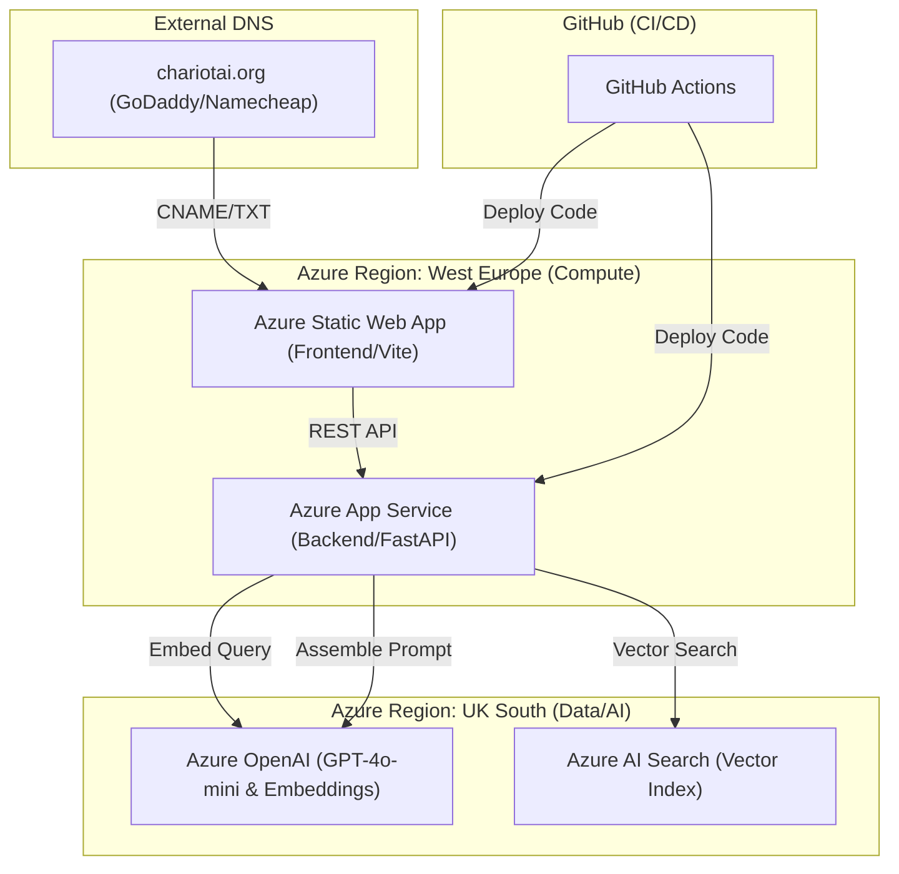

# ChariotAI — System Architecture Specification

This document provides a high-level technical overview of the **ChariotAI** student support chatbot architecture.

---

## 1. High-Level Overview

ChariotAI is a **Multi-Region Retrieval Augmented Generation (RAG)** system that connects a React frontend to a FastAPI backend, utilizing Azure managed services for AI and Search.

---

## 2. Layer Breakdown

### A. Presentation Layer (Frontend)
- **Technology**: React v18 (Vite).
- **Hosting**: Azure Static Web Apps (Free Tier).
- **Core Features**:
  - **Glassmorphism UI**: High-end aesthetic with CSS micro-animations.
  - **Streaming UI**: Dynamic chat bubbles with `react-markdown` support.
  - **Safety Interceptor**: Frontend identifies `handoff_required` flags from the API to display emergency contact cards immediately.

### B. Application Layer (Backend)
- **Technology**: FastAPI (Python 3.12).
- **Hosting**: Azure App Service (Linux B1 Plan).
- **Core Logic (LangChain)**:
  - **Conversational Retrieval**: Uses `ConversationalRetrievalChain` from LangChain to handle sequential context across multiple turns.
  - **Guardrails**: A deterministic pre-interceptor checks incoming messages against crisis vectors before sending data to the LLM.
  - **State Management**: History is passed via the REST payload (`messages.slice(-6)`), ensuring the backend remains stateless and scalable.

### C. Data & AI Layer (Cloud Services)
- **Azure AI Search**: Acts as the vector database (HNSW algorithm). Stores institutional knowledge scraped from University of Kent URLs.
- **Azure OpenAI (GPT-4o-mini)**: Provides the reasoning engine for the RAG pipeline.
- **Azure OpenAI (text-embedding-ada-002)**: Converts natural language into 1536-dimensional vectors for semantic search.

---

## 3. Infrastructure & Deployment

### Infrastructure-as-Code (IaC)
- **Provider**: HashiCorp Terraform.
- **Scope**: Provisions every managed resource (RG, SWA, App Service, OpenAI) from a single configuration set.
- **Variables**: Secret management is handled via `terraform.tfvars` (local) and Azure App Service "Environment Variables" (Portal).

### CI/CD Pipeline
- **Monorepo Strategy**: Independent GitHub Actions for `/frontend` and `/backend`. 
- **Triggering**: Deployments are only triggered when changes occur in their respective directories, reducing build times and CI/CD spend.

---

## 4. Multi-Region Strategy (SAY THIS IN INTERVIEW)
To bypass regional capacity quotas (Gaps in UK South for certain App Service SKUs), ChariotAI uses a **Distributed Cloud Model**:
1. **Compute (SWA & App Service)**: Located in **West Europe** (Amsterdam).
2. **AI Data (OpenAI & Search)**: Located in **UK South** (London).
*This ensures data residency for AI models (UK-based) while maintaining high compute availability in Europe.*

---

## 5. Security & Safety
- **GDPR Compliance**: Managed identities and Azure OpenAI's non-retention policies ensure student data is not used for retraining.
- **Crisis Handoff**: A hard-coded safety net for life-threatening queries, bypassing probabilistic LLM responses for deterministic, official university emergency advice.
